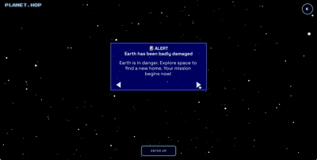

# 75HER Project: Planet Hop
Kids ages 8–14 learn why protecting Earth matters through a 5-minute interactive space adventure with no downloads, playable in browser, mobile, or with a VR headset.

## 🎯 Problem Statement
**Who:**  
Children ages 8–14 who are beginning to learn about science and the environment.

**Problem:**  
Climate education is often too abstract and text-heavy for this age group, making it difficult for children to understand how climate change works or how their actions affect the planet. At the same time, engaging and immersive tools that make environmental learning interactive are limited.

**Impact:**  
Without accessible and engaging climate education, many children struggle to connect scientific concepts to real-world actions, contributing to declining interest in science and fewer opportunities to build early environmental awareness.

## ✨ Solution Overview
**What we built:**  
Planet Hop is a free interactive 3D space adventure accessible on browser, mobile, and VR headsets that helps children ages 8–14 learn about the solar system and why protecting Earth matters. 

Through a short story-driven journey, players explore each planet, discover why most are unsuitable for human life, and ultimately learn why Earth is uniquely valuable. 

The experience combines education, storytelling, and immersive technology to make climate learning engaging and memorable.

Aligns with UN SDG 4 - Quality Education and UN SDG 13 - Climate Action



**Key Features:**
- **Immersive 3D Solar System Exploration**: Built with Three.js, players can explore a fully interactive 3D solar system with rotating planets and realistic textures based on NASA imagery, making space science visually engaging and easier to understand.
- **Cross-Platform Web + VR Experience**: Planet Hop runs in the browser on laptops and phones and includes an “Enter VR” mode for compatible headsets, allowing players to stand inside the solar system and experience the story in immersive 3D.
- **Accessible and Inclusive Learning Design**: The experience is designed to be accessible and inclusive, with screen reader support, keyboard navigation, high-contrast visuals, bilingual language support (English and Spanish) depending on browser language settings, responsive design, and links to real-world climate action resources at the end of the journey.

## 🚀 Quick Start & Demo Path

### Live Demo
Access the deployed application directly at: https://planet-hop-seven.vercel.app/

### Local Development
Installation Requirements: Node.js (version 18 or higher)

```bash
# Clone and run
git clone https://github.com/jessicauv/planet_hop.git && cd planet_hop && npm install && npm run dev
```

Access: Open http://localhost:5173 in your browser.

### 60-Second Demo Path
- **Step 1:** Click "LAUNCH" on the intro screen → Experience a hyperspace transition into the 3D solar system
- **Step 2:** Navigate through each planet using arrow keys, mouse clicks, or VR controllers → Learn why each planet is unsuitable for human life through interactive fact panels
- **Step 3:** Select a planet from the final selection screen → Discover why Mars is the best option and learn how to protect Earth through climate action
- **Optional:** Change browser language to Spanish to see translation. Can also enable screen reader for your system if you would like to test that functionality.

📹 [Demo Video](https://youtu.be/LN-FqTSl0rQ)  | 🔗 [Live Demo](https://planet-hop-seven.vercel.app/) 

### VR Testing Instructions

#### With VR Headset (Meta Quest, HTC Vive, etc.)
1. **Requirements**: Compatible VR headset and WebXR-enabled browser (Chrome, Edge, or Firefox with WebXR support)
2. **Steps**:
   - Open the application in your WebXR-compatible browser
   - Click the "ENTER VR" button that appears after launching the experience
   - Put on your VR headset and follow the on-screen instructions
   - Use your VR controllers to navigate:
     - **X/A Button**: Next/Select
     - **Y/B Button**: Back
     - **Right Thumbstick Press**: Mute/Unmute audio
     - **Gaze at planet + X**: Choose that planet

#### Without VR Headset (Using Immersive Web Emulator Chrome Extension)
1. **Install the Extension**: Download and install the "Immersive Web Emulator" extension from the Chrome Web Store
2. **Enable the Extension**: Click the extension icon and select "Enable"
3. **Open Developer Tools**: Press F12 or right-click → Inspect
4. **Switch to VR Mode**: In the developer tools, select WebXR from the top drop-down menu, make sure Quest 3 is selected
5. **Test VR Features**:
   - Load the website and click LAUNCH, then click the ENTER VR button
   - Click on the VR headset and use your mouse to simulate head movement
   - Use left and right controllers:
     - **X/A Button**: Next/Select
     - **Y/B Button**: Back
     - **Right Thumbstick Press**: Mute/Unmute audio
     - **Gaze at planet + X**: Choose that planet (this is hard to simulate with the emulator so just select the planet by choosing with mouse)

**Note**: The Immersive Web Emulator allows you to test VR functionality without requiring expensive hardware, making development and testing accessible to everyone.

## 🏗️ Technical Architecture
**Components**:
- **Frontend**: Three.js (3D rendering engine) + HTML/CSS/JavaScript - Creates the interactive 3D solar system, UI panels, and cross-platform experience
- **Backend**: None (static web application) - Runs entirely in the browser with no server requirements
- **Database**: None - All data is embedded in the application files
- **AI Integration**: None - This is a traditional web application without AI components

**Key Technologies**:
- **Three.js** - Core 3D engine for rendering planets, stars, and interactive elements
- **Vite** - Build tool and development server
- **Howler.js** - Audio management for sound effects and background music
- **WebXR** - VR support for immersive headset experiences
- **OrbitControls** - Camera controls for desktop/mobile interaction

## 📋 Project Logs & Documentation

| Log Type      | Purpose                     | Link to Documentation              |
|---------------|----------------------------|------------------------------------|
| Decision Log  | Technical choices & tradeoffs | [Decision Log](docs/DECISION_LOG.md) |
| Risk Log      | Issues identified & fixed   | [Risk Log](docs/RISK_LOG.md)       |
| Evidence Log  | Sources, assets, & attributions | [Evidence Log](docs/EVIDENCE_LOG.md) |


## 🧪 Testing & Known Issues

**Test Results**
- **Cross-Platform Compatibility**: ✅ Tested and working on desktop browsers (Chrome, Safari)
- **Mobile Support**: ✅ Responsive design tested on iOS and Android devices
- **VR Functionality**: ✅ WebXR support tested with Immersive Web Emulator Quest 3 headset
- **Accessibility**: ✅ Screen reader support, keyboard navigation, and high-contrast visuals implemented

**Known Issues**
- **VR Controller Mapping**: Some VR controllers may have slightly different button mappings than documented.
- **VR Emulator Planet Selection Laggy**: In VR mode, the gaze at planet + X to select a planet at the end is difficult to do with the Immersive Web Emulator. There's some lag when it comes to updating the camera's view direction.

**Workarounds**
- **VR Controllers**: Refer to your headset's documentation for exact button mappings
- **VR Emulator Planet Selection Laggy**: Use your mouse to select a planet instead

**Next Steps & Future Enhancements**
- **Advanced Interactions**: Add ability to enter planets, launch satellites, and interactive voice narration
- **Additional Language Support**: Expand beyond English/Spanish to include more languages
- **Educational Analytics**: Track learning outcomes and engagement metrics to measure against our success test

## 👥 Team & Acknowledgments
- **Team Name**: Jess & Steph
  - Jess - Software Engineer
  - Steph - Product & Design Lead
- **Special thanks to**: CreateHER Fest

## 📄 License & Attributions

**Project License**  
MIT License - A permissive open-source license that allows for free use, modification, and distribution.

**Asset Licenses**  
Please see [Evidence Log](docs/EVIDENCE_LOG.md) for complete list of assets used

**AI Usage Statement**  
This project used AI in development. All AI-generated code was reviewed & tested. See [Evidence Log](docs/EVIDENCE_LOG.md) for more details.

Built with ❤️ for #75HER Challenge | CreateHER Fest 2026.

